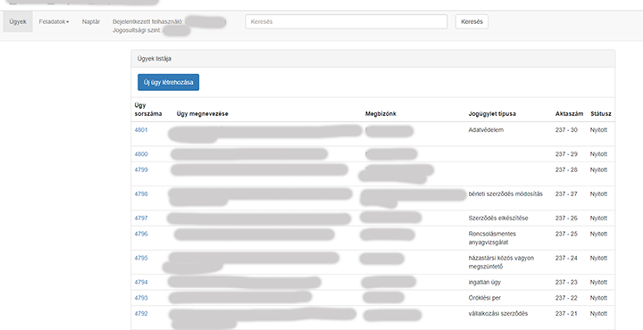
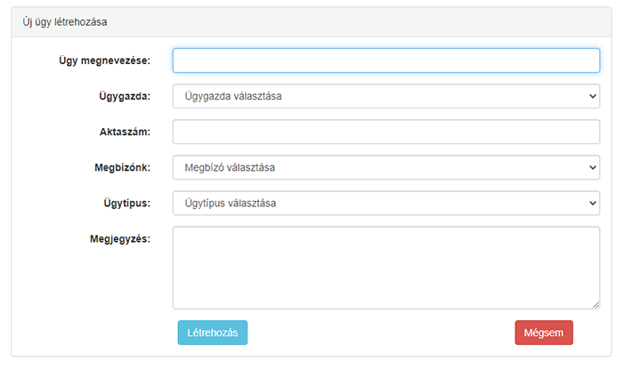
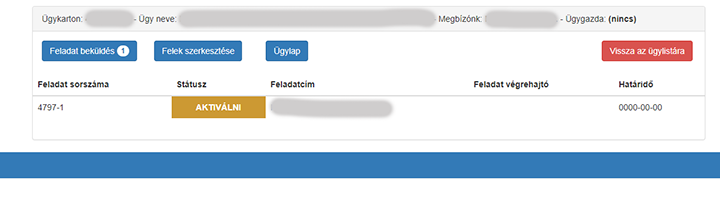
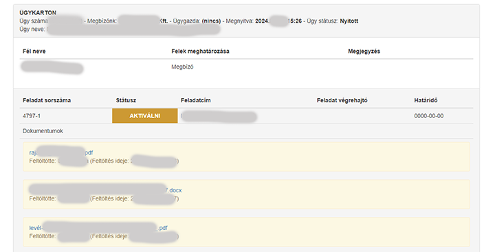

# Ügyvédi ügyviteli program

## CodeIgniter 3 - MySQL

### PHP backend, HTML-CSS frontend, Bootstrap

A program az egyes ügyek kezeléskor követi a munkatársaknak kiadott feladatokat, azok határidejét, készültségét, a feladattal kapcsolatos ráfordításokat, megjegyzéseket, belső üzeneteket. Az egyes ügyeken belül az egyes feladatokhoz dokumentunmokat lehet a rendszerbe tölteni. 

A program használatakor több jogosultsági szint állítható be, az adott munkatárs jogsultságainak függvényében. (Például vihet fel ügyet és feladatot is, de nem aktiválhatja, hogy induljon a feladat, azt majd a vezető teszi meg.)

<table>
<tr>
<td></td>
</tr>
<tr>
<td></td>
</tr>
<tr>
<td></td>
</tr>
<tr>
<td></td>
</tr>

